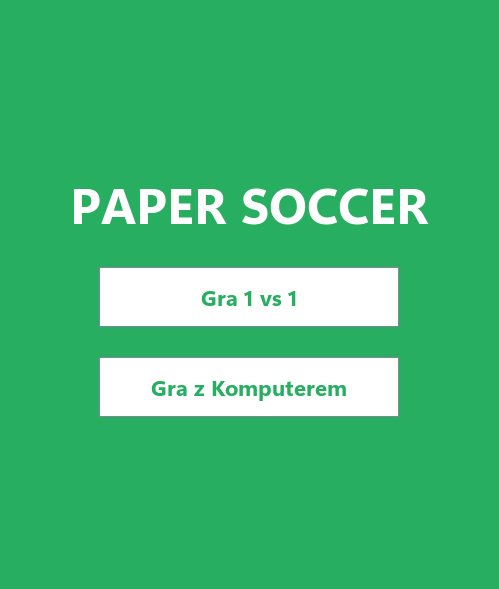
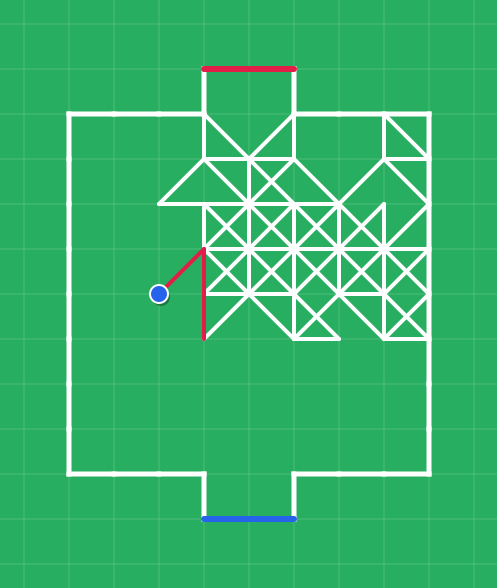
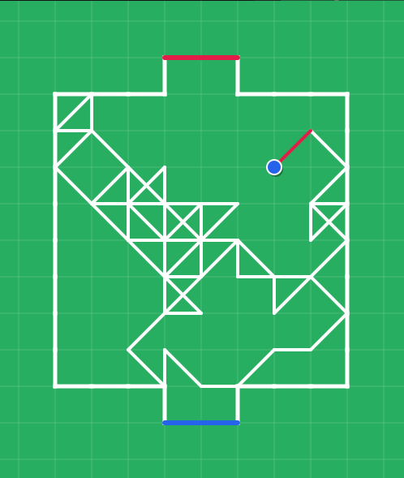

# Paper Soccer (Piłkarzyki na kartce)

Projekt na studia.

Implementacja gry "Piłkarzyki na kartce" w języku Java. Aplikacja desktopowa z interfejsem graficznym opartym na bibliotece Swing.

## Tryby gry

- Gra 1 vs 1 na jednym komputerze (hot-seat)
- Gra przeciwko komputerowi (poziomy trudności: Łatwy, Średni, Trudny)

## Zrzuty ekranu

Konfiguracja:

| Menu główne | Wybór poziomu trudności |
|:---:|:---:|
|  |  |

Rozgrywka:

| Rozgrywka | Rozgrywka |
|:---:|:---:|
|  |  |

## Zasady

Piłka zaczyna na środku boiska. Gracze na przemian wykonują ruchy o jedno pole w pionie, poziomie lub na ukos, rysując tor piłki.

- Nie można prowadzić linii po torze już narysowanym ani po bandzie boiska.
- Wejście na węzeł już odwiedzony lub na bandę daje dodatkowy ruch (odbicie).
- Wejście na nowy węzeł kończy turę i oddaje ruch przeciwnikowi.
- Wprowadzenie piłki do bramki przeciwnika kończy grę zwycięstwem.
- Gracz, który nie ma żadnego dozwolonego ruchu, przegrywa.
- Krzyżowanie linii na ukos jest dozwolone.

## Wymagania

- Java 17 lub nowsza

## Kompilacja i uruchomienie

Bez Mavena:

```bash
javac -d out src/main/java/pl/edu/pk/papersoccer/*.java
java -cp out pl.edu.pk.papersoccer.PaperSoccerApp
```

Przez Mavena, jednolinijkowo:

```bash
mvn -q compile exec:java
```

## Testy

Uruchomienie testów jednostkowych wymaga Mavena:

```bash
mvn test
```

## Użyte technologie

- Java 17 (Swing, AWT)
- Maven
- JUnit 5

## Autorzy

- Szymon Rafałowski: logika gry i architektura
- Wiktor Sasnal: interfejs graficzny i testy jednostkowe

